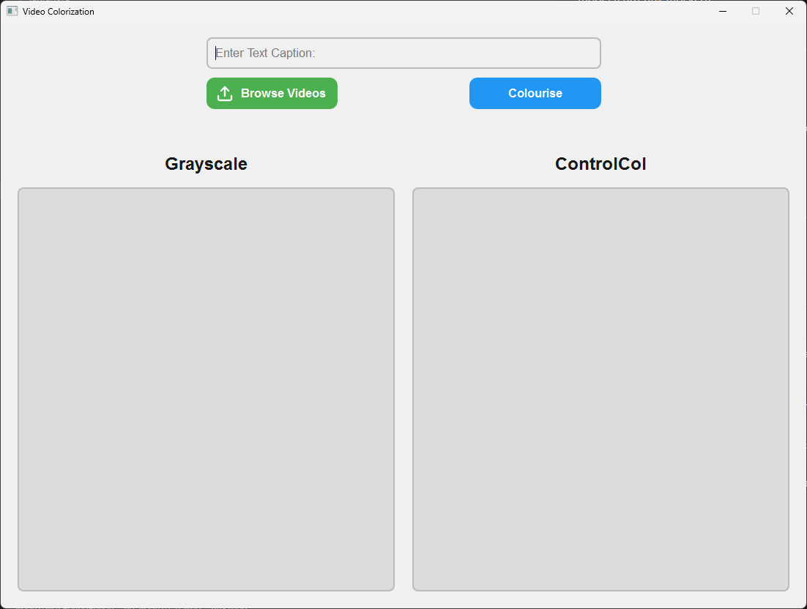

# Video Colorization App

This is a PySide6-based GUI application that allows users to upload a grayscale video, input a custom caption, and simulate the colorization of the video using a placeholder deep learning model (currently mocked).




## Features

- **Upload a Grayscale Video**: Users can select a video from their file system.
- **Custom Caption Input**: Users can input a caption that will be used during the colorization process.
- **Colorized Video Preview**: Displays a mock colorized version of the grayscale video (for demonstration purposes).
- **Responsive GUI**: Built with PySide6, the app has a modern and user-friendly interface.

## Requirements

- Python 3.9
- PySide6

## Installation

1. **Clone the repository**:
   ```bash
   git clone https://github.com/yourusername/video-colorization-app.git
   cd video-colorization-app
2. **(Optional) Create a virtual environment**:
    ```bash
    python -m venv venv
    source venv/bin/activate  # On Windows: venv\Scripts\activate
2. **If you don't have a requirements.txt file, you can install PySide6 directly**:
    ```bash
    pip install PySide6
